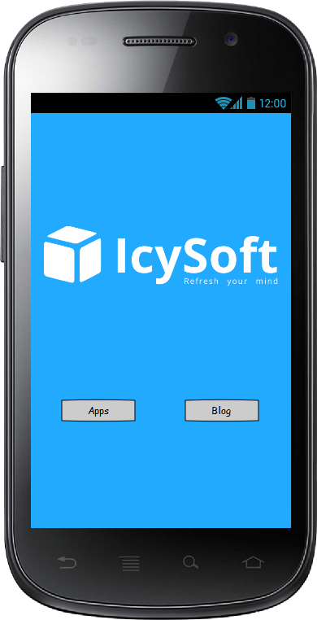
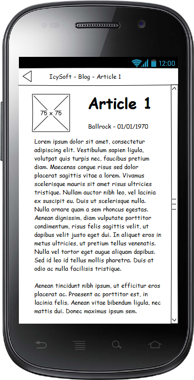

Notre [premier article](http://blog.rockball.fr/ionic-presentation-partie-1/) sur le framework Ionic, nous a permis de survoler les différents aspect de Ionic, de son installation à la compilation d'une nouvelle application en passant par la création d'une rendu. Dans ce nouvel article nous allons plonger un peu plus dans le détail de ce que nous propose le framework Ionic. Pour cela nous allons reprendre l'application créée dans le premier article et la rendre un peu plus vivante. Le but final est de récupérer les articles de ce blog directement dans notre application de façon dynamique via les API déjà codées pour celui-ci. Nous mettrons pour cela en pratique plusieurs notions tels que le pull-to-refresh ou l'infinite scrolling.

### I. Définition du besoin

Pour commencer nous allons faire quelques petits sketch de ce qu'on veut obtenir. Mettre sur papier ses idées avant de partir tête baissée dans la réalisation peut permettre de nous éviter quelques soucis.

Résumons donc pour cette application, nous avons besoin :
- Une page d'accueil permettant de se rediriger vers le blog
- Une page listant les articles avec un aperçu, chaque article sera cliquable et permettra de se rediriger vers la page de détail.
- Un page permettant de visualiser l'article dans sa globalité.

Nous resterons sciemment sur un fonctionnement simple afin de ne pas s'écarter de notre but initial.

Voici ce que donne les sketch de notre application :


 

Il est à noter que le logiciel utilisé pour la réalisation de rendus ci-dessus est [Pencil](https://github.com/prikhi/pencil/releases).

### II. Mise en place des bases

Nous allons repartir d'une appplication vierge pour cela, comme nous l'avons vu lors du premier article :

```bash
ionic start icysoft blank
```

À partir de la nous pouvons demarrer le developpement de notre application interactive.

### III. La structure

Plaçons-nous dans le dossier www. Nous avons actuellement la structure suivante

```bash
www
  ├───css
  │   └───style.css
  ├───img
  ├───js
  │   └───app.js
  ├───lib
  │   └───ionic
  └───index.html
```

Comme vu plus haut nous aurons 3 pages principales, je propose donc dès à present d'ajouter un nouveau dossier *templates* qui contiendra nos templates de page qui seront remplis dynamiquement avec Angular.
Créons donc tout de suite les fichiers :
* `accueil.html`
* `listeArticles.html`
* `detailArticle.html`

Du coté JS, j'ai personnellement l'habitude de bien séparer mes controllers Angular pour eviter les confusions de traitement Javascript et améliorer la maintenabilité de mes applications. Je vais donc appliquer cette doctrine ici.
Créons maintenant nos controllers Angulars dans un dossier *js/controllers/*.
* `accueilController.js`
* `listeArticlesController.js`
* `detailArticleController.js`

Nous n'aurons pas besoin d'énormement de styles CSS, une seule feuille de style conviendra donc parfaitement à nos besoins. Pas de modification de ce coté là.

Voici notre arborescence de projet :
```bash
www
  ├───css
  │   └───style.css
  ├───img
  ├───js
  │   ├───controllers
  │   │   ├───accueilController.js
  │   │   ├───listeArticlesController.js
  │   │   └───detailArticleController.js
  │   └───app.js
  ├───lib
  │   └───ionic
  ├───templates
  │   ├───abstractArticle.html
  │   ├───accueil.html
  │   ├───listeArticles.html
  │   └───detailArticle.html
  └───index.html
```
C'est joli tout plein ! Oui enfin bon sans aucun contenu nous n'allons pas aller bien loin. Les sous-parties suivantes vont donc décrire étape par étape la complétion de ces fichiers.

### IV. Le contenu "statique"

#### 1. [`controllers.js`] Il faut bien commencer quelque part (Initialisation des controllers AngularJS)

Rien de bien compliqué ici, nous allons juste initialiser nos controllers AngularJS pour pouvoir les appeler depuis notre module principal `app.js`. Pour cela modifions les fichiers suivants pour qu'ils ressemblent au code ci-dessous :
```js
'use strict';

angular.module('accueilController', [])
.controller('AccueilCtrl', function(){
});
```
* `accueilController.js`
* `listeArticlesController.js`
* `detailArticleController.js`

On initialise juste des controllers vides. Nous les remplirons plus tard.

#### 2. [`app.js` & `index.html`] Mais où est-ce qu'on va ? (Routes et Redirections)
J'ai abordé très vite cette partie dans l'article 1 qui n'avait pour but que de présenter quelques base sans appronfidissement. Cette partie à donc pour but d'approfondir ce point.
Pour naviguer dans un site internet ou meme dans la vie de tout les jours il est important de savoir ou est-ce que l'on va, que ce soit en cliquant sur un lien ou à un embranchement de route. Dans une application ionic c'est un peu pareil sauf que pour concerver l'état de l'application d'une page à l'autre on utilise un router et, plus precisement `angular-ui-router`. Ce router va definir pour chaque embranchement ou url dans notre cas, le template ou le controller à utiliser. Ce qui vous me l'accorderez corresponds pas mal à ce que nous avons initialisé juste au-dessus... De la à dire que je l'ai fait exprès :p

##### a. [`index.html`]
Occupons nous tout d'abord du fichier index.html. Ce dernier apportera le support à tous les templates. C'est le layout de base dans lequel sera inclus nos templates. Nous allons deja voir ce que celui-ci contient`suite à l'init de projet avec le starter blank.
```html
<!DOCTYPE html>
<html>
  <head>
    <meta charset="utf-8">
    <meta name="viewport" content="initial-scale=1, maximum-scale=1, user-scalable=no, width=device-width">
    <title></title>

    <link href="lib/ionic/css/ionic.css" rel="stylesheet">
    <link href="css/style.css" rel="stylesheet">

    <!-- IF using Sass (run gulp sass first), then uncomment below and remove the CSS includes above
    <link href="css/ionic.app.css" rel="stylesheet">
    -->

    <!-- ionic/angularjs js -->
    <script src="lib/ionic/js/ionic.bundle.js"></script>

    <!-- cordova script (this will be a 404 during development) -->
    <script src="cordova.js"></script>

    <!-- your app's js -->
    <script src="js/app.js"></script>
  </head>
  <body ng-app="starter">

    <ion-pane>
      <ion-header-bar class="bar-stable">
        <h1 class="title">Ionic Blank Starter</h1>
      </ion-header-bar>
      <ion-content>
      </ion-content>
    </ion-pane>
  </body>
</html>
```

Tout d'abord les inclusions CSS. l'on peut voir tout d'abord les fichier `ionic.css` et `style.css`. Le premier correspond à la feuille de style ionic comprenant tous les composants, tandis que le second correspond à la feuille de style de notre application. L'inclusion CSS commenté est présente dans le cas de l'utilisation de Sass pour modifier la feuille de style ionic.
> Si vous ne connaissez pas [Sass](http://sass-lang.com/) je ne peux que vous conseiller de vous renseigner sur le sujet.
Cependant le cas present cela ne nous sera pas utile nous pouvons donc dès à présent supprimer cette partie de notre code.

Du coté des inclusions javascript nous avons `ionic.bundle.js`, `cordova.js` et notre `app.js`. Le premier est le fichier js de ionic comprenant la charge utile de tous ces composants, le second, qui ne sera d'ailleur pas fonctionnel en developpement (en Desktop en tout cas), comprend tout le coeur de Cordova sur lequel comme vous devez maintenant surement le savoir, repose Ionic. Pourquoi n'est-il pas accessible en devellopement me direz-vous ? Eh bien il comprend tout le metier qui communiquera avec le téléphone et réalisera le lien entre les fonctionnalité natives du téléphone et notre code JS. Ce fichier ne peut donc fonctionner sur Desktop et est OS-dépendant. Ce fichier est uniquement ajouté au package lors de la compilation pour l'OS Cible.
Le dernier fichier est app.js qui est le point d'entrée js de notre application.
Nous pouvons également dès à present ajouter nos controllers aux inclusions cela nous evitera de revenir modifier le fichier plus tard.
```html
<script src="js/controllers/accueilController.js"></script>
<script src="js/controllers/listeArticlesController.js"></script>
<script src="js/controllers/detailArticleController.js"></script>
```

Passons maintenant à la partie HTML et balises Ionic. Renommons notre app (nous le ferons également du coté de l'`app.js`) puis passont au balises ionic. Pour permettre la navigation par template et par routes il nous faut integrer un composant Ionic nommé ion-nav-view... et c'est tout :)

Ce qui devrait vous donner quelque chose qui ressemble à ça :
```html
<!DOCTYPE html>
<html>
  <head>
    <meta charset="utf-8">
    <meta name="viewport" content="initial-scale=1, maximum-scale=1, user-scalable=no, width=device-width">
    <title></title>
    <!-- Styles -->
    <link href="css/style.css" rel="stylesheet">
    <!-- Frameworks -->
    <link href="lib/ionic/css/ionic.css" rel="stylesheet">
    <script src="lib/ionic/js/ionic.bundle.js"></script>
    <script src="cordova.js"></script>
    <!-- Application et Controllers -->
    <script src="js/app.js"></script>
    <script src="js/controllers/accueilController.js"></script>
    <script src="js/controllers/listeArticlesController.js"></script>
    <script src="js/controllers/detailArticleController.js"></script>
  </head>
  <body ng-app="icysoft">
    <ion-nav-view></ion-nav-view>
  </body>
</html>
```

##### b. [`app.js`]
Au tour de `app.js` de passer à la casserole c'est ici qu'on aura notre gestion de route pour l'application, il appelera également tous nos controllers.

```js
// Ionic Starter App

// angular.module is a global place for creating, registering and retrieving Angular modules
// 'starter' is the name of this angular module example (also set in a <body> attribute in index.html)
// the 2nd parameter is an array of 'requires'
angular.module('starter', ['ionic'])

.run(function($ionicPlatform) {
  $ionicPlatform.ready(function() {
    if(window.cordova && window.cordova.plugins.Keyboard) {
      // Hide the accessory bar by default (remove this to show the accessory bar above the keyboard
      // for form inputs)
      cordova.plugins.Keyboard.hideKeyboardAccessoryBar(true);

      // Don't remove this line unless you know what you are doing. It stops the viewport
      // from snapping when text inputs are focused. Ionic handles this internally for
      // a much nicer keyboard experience.
      cordova.plugins.Keyboard.disableScroll(true);
    }
    if(window.StatusBar) {
      StatusBar.styleDefault();
    }
  });
})
```
Si vous n'êtes pas familiarisé à Angular et Javascript (callback nottament), cela peut faire un peu peur. Ne vous inquietez pas décomposons cela :
```js
angular.module('starter', ['ionic'])
```
Le module starter (que l'on renommera) inclus une dependance à `ionic`. Ce dernier contenu dans le fichier js Ionic que nous avons inclus dans notre index.html. Il contient toutes les methodes et outils de ionic.
```js
.run(function($ionicPlatform) {
```
Juste en dessous, la methode run est utilisée celle-ci permet d'exécuter du code une fois que le module a chargé toutes ces dépendances (ici Ionic donc). On passe à `run` une fonction de callback qui sera appelé une fois cette tache réalisée. Ici celle-ci prend en parametre `$ionicPlatform` qui est une abstraction Angular pour l'utilitaire `ionic.Plateform`.
```js
$ionicPlatform.ready(function() {
```
La methode `ready` de `$ionicPlatform` est ensuite appelée, son fonctionnement est identique au `run` du module angular, on lui passe une fonction de callback qui sera appelée une fois le traitement fait. Il est a noter que d'une manière générale le functionnement par callback est très répendu en javascript.
```js
if(window.cordova && window.cordova.plugins.Keyboard) {
	// Hide the accessory bar by default (remove this to show the accessory bar above the keyboard
	// for form inputs)
	cordova.plugins.Keyboard.hideKeyboardAccessoryBar(true);

	// Don't remove this line unless you know what you are doing. It stops the viewport
	// from snapping when text inputs are focused. Ionic handles this internally for
	// a much nicer keyboard experience.
	cordova.plugins.Keyboard.disableScroll(true);
}
if(window.StatusBar) {
	StatusBar.styleDefault();
}
```
Vous vous souvenez que je vous ai parlé dans le point précédent du fichier `cordova.js`, celui-ci est injecté dans notre application est sert de pont de communication avec les fonctions natives du téléphone.
Ici on verifie que ce fichier est bien injecté (ainsi que son plugin Keyboard) avant d'executer les commmandes. Typiquement ce n'est pas le cas sur Desktop. Ensuite l'on applique quelque modification au clavier natif qui sont documenté dans le code ci-dessus.
StatutBar est également un [plugin Cordova](https://github.com/apache/cordova-plugin-statusbar) ici il permet d'appliquer le style part defaut (texte sombre pour les fond lumineux).

Et c'est tout.

Maintenant que l'on a compris le fonctionnement de ce fichier nous allons demarrer les modifications.

Nous allons d'abord renommer notre module angular puis integrer `angular-ui-router`
```js
angular.module('icysoft', ['ionic'])
```

Pour `angular-ui-router` nous allons initialiser les différentes routes et etats de notre application. Chaque écran sera représentée par une url spécifique, c'est grâce à cet URL que notre router saura quel template afficher et avec quel controller AngularJS. Nous avons uniquement 3 écrans dans notre application, nous pouvons donc resumer toutes ces routes sous la forme du tableau suivant :

| Ecran              | URL            | Variable | Template           | Controller         |
| :----------------- | :------------- | :------- | :----------------- | :----------------- |
| Accueil            | /              |          | accueil.html       | AccueilCtrl        |
| Liste des articles | /blog/         |          | listeArticles.html | ListeArticlesCtrl  |
| Article            | /blog/:article | :article | detailArticle.html | DetailArticleCtrl |

On peut voir que l'url d'accès aux articles sera différentes selon l'article, ce qui est somme toute relativement logique :D

Implémentons à présent ce comportement dans notre `app.js` :

```js
.config(function($stateProvider, $urlRouterProvider) {
  $stateProvider
  .state('index', {
    url: '/',
    views: {
      'content': {
        templateUrl: 'templates/accueil.html',
        controller : 'AccueilCtrl'
      }
    }
  })
  .state('blog', {
    abstact: true,
    url: '/blog',
    views: {
      'content': {
        templateUrl: "templates/abstractArticle.html"
      }
    }
  })
  .state('blog.list', {
    url: '',
    views: {
      'blog': {
        templateUrl: "templates/listeArticles.html",
        controller: 'ListeArtCtrl'
      }
    }
  })
  .state('blog.article', {
    url: '/:article',
    views: {
      'blog': {
        templateUrl: "templates/detailArticle.html",
        controller: 'DetailArtCtrl'
      }
    }
  });

  $urlRouterProvider.otherwise('/');
});
```

On peut voir tout les elements des tableaux dans ce code. Les seuls élements spéciaux sont l'abstract et le otherwise.

```js
.state('blog', {
  abstact: true,
  url: '/blog',
  views: {
    'content': {
      templateUrl: "templates/abstractArticle.html"
    }
  }
})
```
L'abstract correspond à la création d'une route abstraite qui permet de creer aisement un systeme "d'heritage" sur les routes. Ici par exemple j'ai ajouté un temlate pour qu'il soit affiché chez tous ces fils et qui correspondra au header. Il est possitionné sur l'url `/blog`. Ensuite je definis une route blog.list qui correspond à l'url vide (donc `/blog`) et un blog.articles qui correspond à l'url `/:article` donc (`/blog/:article`).

```js
$urlRouterProvider.otherwise('/');
```
Dans tous les autres cas on redirige vers / donc l'accueil.

Voila avec cela on devrait pouvoir facilement trouver notre chemin ;)

##### c. En savoir plus
Vous pouvez trouvez plus d'informations sur le routing avec `angular-ui-router` et ionic sur les liens suivants :
* [Wiki Angular-ui-router](https://github.com/angular-ui/ui-router/wiki)
* [Formula sur les Routes de Ionic - partie 1](http://learn.ionicframework.com/formulas/navigation-and-routing-part-1/)
* [Formula sur les Routes de Ionic - partie 2](http://learn.ionicframework.com/formulas/navigation-and-routing-part-2/)

#### 2. [`accueilController.js` & `accueil.html`] Bienvenue mesdames & messieurs ! (Gestion de l'accueil)

##### a. [`accueil.html`]

Vous avez pu le voir dans la partie Définition du besoin, l'accueil de notre application est assez simple :
* Un fond de couleur
* Un logo
* Deux boutons (dont un inactif)

Petit rappel de notre écran :


Pour réaliser cela nous allons bien sur utiliser les composants ionic mais également le system de flexbox CSS3 qui va grandement nous aider pour disposer joliment nos éléments.
> Flexbox étant un outil très pratique CSS3 je vous recommande chaudement de vous renseigner dessus :
> * [Article AlsaCreation](http://www.alsacreations.com/tuto/lire/1493-css3-flexbox-layout-module.html)
> * [Outils de génération Flexbox](http://the-echoplex.net/flexyboxes/)

Voici l'état de mon template `accueil.html` après implémentation :
```html
<ion-view view-title="Icysoft">
	<style>
	</style>
	<ion-content class="Background" overflow-scroll="true">
		<div class="Logo">
		</div>
		<div class="SubBox">
			<button class="SubBox-item-center button button-large button-positive">Apps</button>
			<button class="SubBox-item-center button button-large button-positive" ng-click="blog()">Blog</button>
		</div>
	</ion-content>
</ion-view>
```
Ici on place uniquement notre `div` avec notre logo et notre `div` de boutons. Ces derniers utilise des composants Ionic et le bouton Blog est lié à la fonction `blog()` de notre controller via la directive `ng-click`.

```css
/* Content */
.Background {
	background-color: #22AAFF;
	display: flex;
	webkit-display:flex;
	moz-display:flex;
	width:100%;
}

.Logo {
  width: 100%;
	height: 80%;
  background-image: url(../img/logo.png);
  background-size: 75%;
  background-repeat: no-repeat;
  background-position: center;
}

.SubBox {
	display: flex;
	justify-content: space-around;
}

::-webkit-scrollbar,
*::-webkit-scrollbar {
	display: none;
}
```

Quelques éléments intérressants ici :
- Un petit trick CSS Ionic pour supprimer la scrollbar avec overflow-scroll=true.
- Le flebox pour l'alignement réparti des boutons (que je trouve, personnellement, très bien fait et facile à réaliser en flexbox)
- La taille de notre logo qui s'ajustera à la taille de l'écran.

##### b. [`accueilController.js`]

Ce controller ne va pas être très rempli il nous permettra juste de réaliser les transitions avec les écrans suivants. Mais pourquoi utiliser un controller alors qu'on pourrait juste faire un lien vers l'écran suivant ? Justement pour permettre de gerer en Javascript tous les éléments complémentaires dont nous pourrions avoir besoin (exemple : Publicité, Analytics, Stockage de session, etc...)

En l'occurence ici notre controller ressemblera à quelque chose comme cela :
```js
angular.module('accueilController', [])
.controller('AccueilCtrl', function($scope,$state){
  $scope.blog = function() {
    $state.go('blog.list');
  }
});
```
On inclue les [scopes](https://docs.angularjs.org/guide/scope) `$scope` et `$state` qui vont respectivement nous permettre definir nos fonctions dans le scope du controller et d'acceder au scope de routes et états pour pouvoir alterer celui-ci (changer de page).
`$state.go` permet donc de changer l'état de l'application. (avec en prime une jolie transition :D)

#### 3. [`abstractArticle.html`] Abstrait toi même ! (Gestion du template abstrait de notre application)

Ce template va uniquement nous servire ici de header pour nos pages `listeArticles` et `detailArticle`. Nous allons uniquement definir le theme de la bar de navigation ainsi qu'un petit bouton magique de "back" qui s'accorde automatiquement avec angular-ui-router pour réaliser un retour arriere cohérent dans notre application.

```html
<ion-nav-bar class="bar-positive">
     <ion-nav-back-button>
     </ion-nav-back-button>
</ion-nav-bar>
<ion-nav-view name="blog"></ion-nav-view>
```
Comme on peut le voir, ce n'est pas grand chose. On definit la bar de navigation via la directive `ion-nav-bar` de Ionic, la class `bar-positive` definit uniquement le jeu de couleur utilisé. La directive `ion-nav-back-button` definit quand à elle le bouton de retour, ni plus ni moins. Une fois la barre de navigation créée, on ajoute juste la ion-nav-view pour que les autres templates soient injectés dedans.

#### 4. [`listeArticlesController.js` & `listeArticles.html`] Des articles par milliers (Gestion de la liste d'articles)

##### a. [`listeArticles.html`]

Ici nous allons implementer un composant Ionic de type liste pour afficher nos articles, dans un premier temps, cette page, cette page ne sera pas interactive, et presentera seulement un liste d'article en dur.

```html
<ion-view view-title="Blog">
	<ion-content class="padding">
		<div class="list">
			<a class="item item-thumbnail-left" href="#" ng-click="article('test')">
				 
				<h2>Article 1</h2>
				<h4>Ceci est le resumé d'un article très intéressant et fort instructif, j'ai nommé Article 1</h4>
			</a>
			[...]
			<a class="item item-thumbnail-left" href="#" ng-click="article('test')">
				 
				<h2>Article X</h2>
				<h4>Ceci est le resumé d'un article très intéressant et fort instructif, j'ai nommé Article X</h4>
			</a>
		</div>
	</ion-content>
</ion-view>
```

Le seul point à retenir ici est le ng-click qui va rediriger vers une méthode similaire à ce que l'on a pu voir précedement.

##### b. [`listeArticlesController.js`]

Il reste une méthode à implementer, pour l'instant, de la a même maniere qu'elle a pu l'être dans le précédent controller. À savoir :
```js
'use strict';

angular.module('listeArticlesController', [])
.controller('ListeArtCtrl', function($scope,$state){
  	$scope.article = function(id) {
  		$state.go('blog.article');
  	}
});
```

#### 5. [`detailArticle.html`] Il est frais, il est beau, mon article ! (Affichage d'un article)

##### a. [`detailArticle.html`]

J'ai utilisé ici, pour changer, le system de Flexbox integré directement dans Ionic via les classes CSS `row` et `col`, je vous invite à aller voir la description du système de grille [TODO].

On obtient quelque chose resemblant à cela :

```html
<ion-view view-title="Article Test">
  <ion-content class="padding">
    <div class="row">
      <div>
        
      </div>
      <div style="margin:10px;">
        <h2>Article Test</h2>
        <h5>Antoine Précigout - 01/01/1970</h5>
      </div>
    </div>
    <div class="col">
      <p>
        Lorem ipsum dolor sit amet, [...] laborum.
      </p>
      <p>
        Lorem ipsum dolor sit amet, [...] laborum.
      </p>
    </div>
  </ion-content>
</ion-view>
```   

Toujours dans une optique statique. Nous dynamiserons tout ca dans le chapitre suivant.

#### 6. Conclusion

Nous avons pu aborder dans ce chapitre tous les éléments structurels nous permettant de creer une application basique et statique. Plus important encore nous pouvons naviguer facilement entre les pages et garder un worflow cohérent avec `angular-ui-router`, ce qui nous permet de faire de `back` entre les pages automatiquement.

### V. L'interactivité


Note : use service & factory
Note : Markdown ? vérifier les services

### VI. Aller plus loin

Note : test de connexion, stockage local ect....
